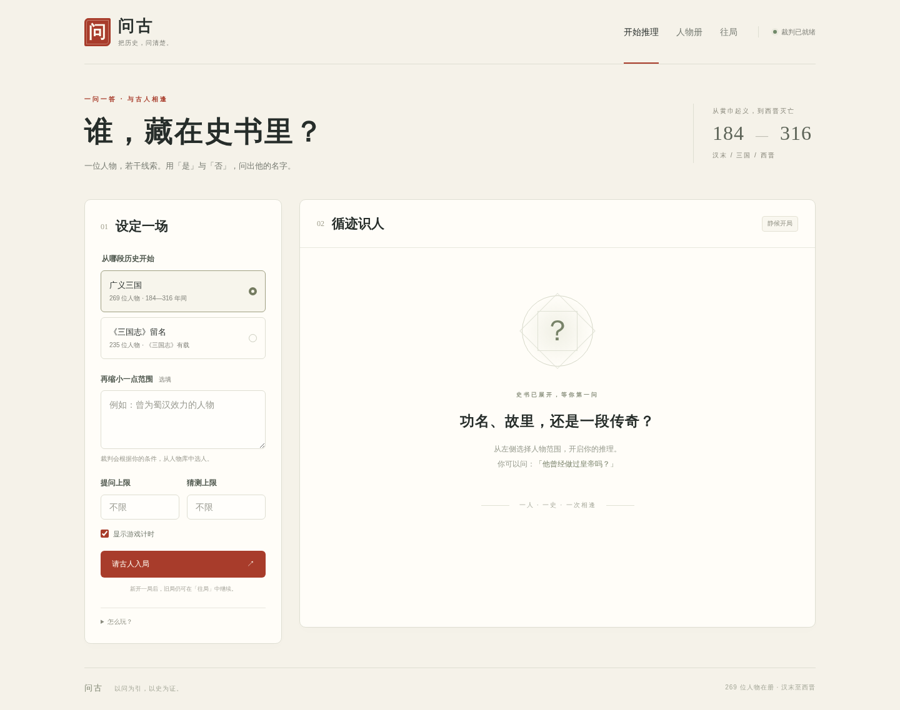

# 问古 · Historical Guess

[English](README.en.md)

一位人物，若干线索。用「是」与「否」，问出藏在史书里的名字。

问古是一个可在本机运行的中文历史人物猜谜 Web 应用：后台模型选人、回答是否问题、判断姓名猜测；浏览器负责游戏界面；SQLite 保存每一局。前端无需构建，也不加载外部字体、脚本或图片。



## 快速开始

需要 **Python 3.10+、Bash 和现代浏览器**。Linux、macOS 可直接运行；Windows 请使用 WSL。启动脚本会创建 `.venv` 并在首次运行时安装依赖；已安装 `uv` 时会优先用它创建环境。

```bash
git clone https://github.com/THUQiXuan/historical-guess.git
cd historical-guess
```

选择以下一种裁判后端即可。

### 方式一：使用本机 Codex

先按照 [官方安装指南](https://learn.chatgpt.com/docs/codex/cli) 安装能运行 `codex app-server` 的 Codex CLI，并在同一系统用户下完成登录：

```bash
codex login
```

每次启动只需一行：

```bash
bash start.sh
```

打开 **http://127.0.0.1:7992**。同一命令会启动 Web 服务和一个持续运行的后台 Codex 进程；按 `Ctrl+C` 一并关闭。此模式沿用你本机的 Codex 认证，无需把密钥放进项目。项目通过 [Codex App Server](https://learn.chatgpt.com/docs/app-server) 的 stdio 协议通信，配置仅作用于该子进程，不修改全局 Codex 配置。

默认使用 `gpt-5.6-sol`，问答与猜测使用 `low` 推理强度，选人使用 `medium`，并请求 `fast`。需要变更时，复制配置模板并编辑本地文件：

```bash
cp .env.example .env
```

| 变量 | 默认值 / 用途 |
| --- | --- |
| `AGENT_PROVIDER` | `codex` |
| `CODEX_MODEL` | 未设置时为 `gpt-5.6-sol`；显式留空则继承本机 Codex 模型 |
| `CODEX_EFFORT` | `low`，问答与猜测的推理强度 |
| `CODEX_SELECT_EFFORT` | `medium`，人物范围筛选与选人的推理强度 |
| `CODEX_SERVICE_TIER` | `fast`；不支持时可设为 `default` |
| `CODEX_AGENT_TIMEOUT` | `180`，一次裁判请求的超时秒数 |

Fast 的可用性和额度消耗取决于模型与账户，参见 [Codex Speed](https://learn.chatgpt.com/docs/agent-configuration/speed)。本项目开发环境中，`fast` 在 App Server 返回的有效配置中显示为 `priority`。一次小样本实测约为：后台启动 13.5 秒、选人 6.0 秒、提问 4.9 秒、猜测 4.2 秒；这些不是性能保证，首次安装依赖和复杂范围筛选可能更久。

### 方式二：使用自己的 OpenAI 兼容接口

此模式不需要安装或登录 Codex。复制 `.env.example` 为 `.env`，在本地填写：

```dotenv
AGENT_PROVIDER=openai
OPENAI_BASE_URL=https://api.openai.com/v1
OPENAI_MODEL=your-model-id
OPENAI_API_KEY=your-api-key
OPENAI_JSON_MODE=schema
```

然后同样运行：

```bash
bash start.sh
```

接口需兼容 [Chat Completions](https://platform.openai.com/docs/api-reference/chat/create)。`OPENAI_BASE_URL` 填 API 基础地址，例如以 `/v1` 结尾的地址；程序会追加 `/chat/completions`。远程接口必须使用 HTTPS，本机接口可以使用 HTTP。

| 变量 | 用途 |
| --- | --- |
| `OPENAI_JSON_MODE=schema` | 请求严格 JSON Schema；适合支持结构化输出的模型 |
| `OPENAI_JSON_MODE=object` | 使用 JSON object 模式兼容其他服务；后台仍校验返回结构 |
| `OPENAI_REASONING_EFFORT` | 可选，问答与猜测的 `reasoning_effort` |
| `OPENAI_SELECT_EFFORT` | 可选，选人请求的 `reasoning_effort` |
| `OPENAI_SERVICE_TIER` | 可选，服务商支持的 `service_tier` |
| `OPENAI_TIMEOUT` | 请求超时秒数，默认 `120` |

不支持推理强度或服务等级字段的服务，请将对应值留空。修改 `.env` 后重启。`.env` 已被 Git 忽略；只在自己的本地文件中填写密钥。

## 玩法与人物范围

1. 选择人物范围，也可追加自然语言条件，例如「曾为蜀汉效力的人物」。裁判只从现有题库中筛选。
2. 设置提问与猜测上限。**留空即无限**；填写时为 1—10000 的整数。
3. 点击「请古人入局」，每次提一个是否问题。合法问题只答 **是 / 否**。
4. 在独立的「猜人物」区域提交姓名或明确别名，裁判只答 **正确 / 错误**。
5. 猜中、猜测次数用尽，或主动结束后，揭晓人物与史料来源。可在「往局」查看记录并继续尚未结束的游戏。

**广义三国**取公元 **184—316 年，含边界**。人物只要在这个区间内某时仍在世即可：可以生于 184 年之前，也可以活到 316 年之后。题库也包含汉末和西晋人物。

**《三国志》留名**是题库中具有《三国志》正文或裴松之注姓名证据的子集，不等于全书全部人物。范围、收集方法、来源与数据使用说明见 [data/SOURCES.md](data/SOURCES.md)；当前数量可在页面查看。

「无法回答」仅用于不合法的提问，例如非是否问题、无法消歧的指代、悖论或改变裁判规则的指令，**不消耗提问次数**。合法问题若史料不足，页面会显示可重试的服务错误，不把「不知道」冒充成「无法回答」或「否」。模型仍可能误判，可结合揭晓后的资料核查。

提问次数用尽后仍可猜人；猜测用尽即结束。计时器可隐藏，计时包含后台思考、等待和页面关闭期间的时间。

## 保存、连接与隐私

游戏保存在 `var/games.sqlite3`，包括人物快照、规则、问答、猜测和时间信息。刷新或重启服务后可继续；浏览器 Cookie 标识各自的历史，清除 Cookie 或更换浏览器不会自动带回原记录。备份数据库时可先停止服务再复制 `var/`。

`.env`、`var/`、数据库和日志均不应提交到仓库。密钥只在服务器端使用；游戏输入和相关人物资料会发送给你选择的模型服务。前端没有账号系统，浏览器会话也不是完整的用户登录系统。

默认仅监听 `127.0.0.1:7992`。修改端口时在启动命令前设置环境变量：

```bash
PORT=9000 bash start.sh
```

`HOST` / `PORT` 由启动脚本读取，请在 Shell 中设置。服务器上运行时，可保持默认监听地址，在自己的电脑执行 SSH 端口转发：

```bash
ssh -N -L 7992:127.0.0.1:7992 YOUR_SSH_ALIAS
```

将 `YOUR_SSH_ALIAS` 替换为平时连接服务器所用的 SSH 别名，保持这个终端窗口打开，再用本机浏览器打开 http://127.0.0.1:7992。

使用 VS Code / Cursor Remote SSH 时，以项目根目录作为工作区打开，编辑器会读取本项目的 `.vscode/settings.json`，其中已配置自动转发 `7992` 并打开浏览器。已有的父级或多根工作区不一定载入该设置；也可在远程窗口的「端口 / Ports」面板手动添加并转发 `7992`，然后点击面板中的本地地址。如果工具分配了不同的本地端口，以面板地址为准。

若部署到公网，应在反向代理上配置 HTTPS 和访问认证，并保护好模型额度。保持单个 Web worker；当前实现的游戏操作锁位于进程内。

## 开发与贡献

```text
static/                 原生 HTML / CSS / JavaScript 界面
server/app.py           FastAPI 路由、游戏规则、会话隔离
server/agent.py         Codex 进程与裁判协议、结果校验
server/openai_agent.py  OpenAI 兼容接口
server/db.py            SQLite 存储
data/characters.json   人物题库
data/SOURCES.md         来源、范围与数据说明
scripts/build_corpus.py 题库校验工具
tests/                  自动化测试
```

安装开发依赖并运行测试：

```bash
python3 -m venv .venv
source .venv/bin/activate
python -m pip install -r requirements-dev.txt
python -m pytest -q
python scripts/build_corpus.py
```

发布前还可在暂存改动后运行 `python scripts/check_public.py`，检查 Git 跟踪内容与历史中是否混入密钥或本地运行数据。检查失败时只显示文件名与规则，不打印疑似密钥。

测试使用模拟裁判与协议响应，不消耗真实模型额度；真实模型的可用性、延迟与事实判断需另外联调。更改前端后可再执行 `node --check static/app.js`。

欢迎提交人物补充、史实勘误与功能改进。新增人物请附可靠来源、184—316 年间在世的证据，以及明确的别名；标记《三国志》人物时需附原文摘录和卷目链接。提交前运行测试和题库校验，避免将个人配置、密钥或游戏记录包含在 PR 中。

## 常见问题

| 情况 | 处理方法 |
| --- | --- |
| 裁判尚未就绪 | Codex 模式检查 CLI 与登录；接口模式检查 `.env` 中的地址、模型和密钥，重启后重试 |
| 模型要求更新 Codex | 更新本机 CLI，或选择当前 CLI 与账户支持的 `CODEX_MODEL` |
| Fast 不可用 | 设置 `CODEX_SERVICE_TIER=default` 后重启 |
| 兼容接口拒绝参数 | 尝试 `OPENAI_JSON_MODE=object`，将不支持的推理强度与服务等级设置留空 |
| 范围没有匹配人物 | 放宽条件，或在「人物册」中检查题库是否收录相关人物 |
| 超时、资料未核实或返回格式异常 | 本次不计次数，可稍后重试；同一提问提交的网络重试会去重 |
| 以前的游戏不见了 | 检查是否保留原数据库，并使用创建游戏时相同的浏览器与站点地址 |

代码采用 [MIT License](LICENSE)。题库中的史料摘录及来源遵循 [数据来源说明](data/SOURCES.md)，不由代码许可证覆盖全部第三方材料。
